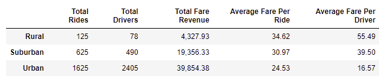
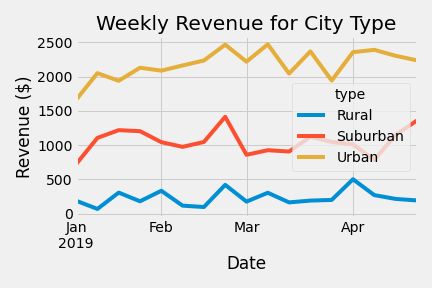

<h1>Pyber Challenge</h1>
<h2>Overview</h2>
The purpose of this challenge was to visualize the ride-sharing data and weekly revenue of Uber drivers within three city types (urban, suburban, and rural).
<h2>Results</h2>
Overall, we saw that the ride-sharing data three different city types varied greatly. For one, the total number of drivers within the rural area was the smallest of the three, with the fewest rides and lowest revenue. Additionally, the average fare per ride within rural areas was the greatest. On the other side, the total number of drivers within urban areas was the greatest, with the lowest average fare per ride, and the greatest total revenue. As expected, the data for suburban areas was inbetween that of urban and rural areas (refer to figures below for supplemental information).  
</img>
</img>
<h2>Analysis</h2>
Based of of these results, I propose three recommendations to the CEO of this company to address the disparity between city types:
  <ol>
    <li>You can consider allocating more drivers from urban areas to rural areas. The average fare per driver within urban areas is low. Thus, if they are reassigned to rural areas, they can help drive the average fare per ride down, and perhaps more individuals will take rides.</li>
    <li>An alternative to the above is to hire more drivers within rural areas to drive the average per ride fare down.</li>
    <li>Another consideration to take into account is that perhaps you can charge higher rates per-ride within urban areas.</li>
  </ol>
